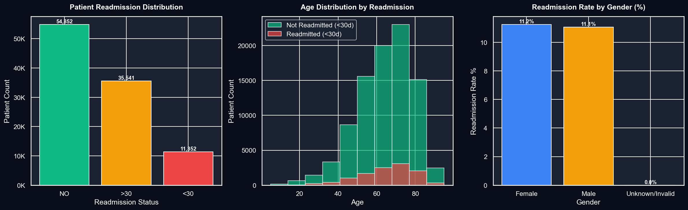
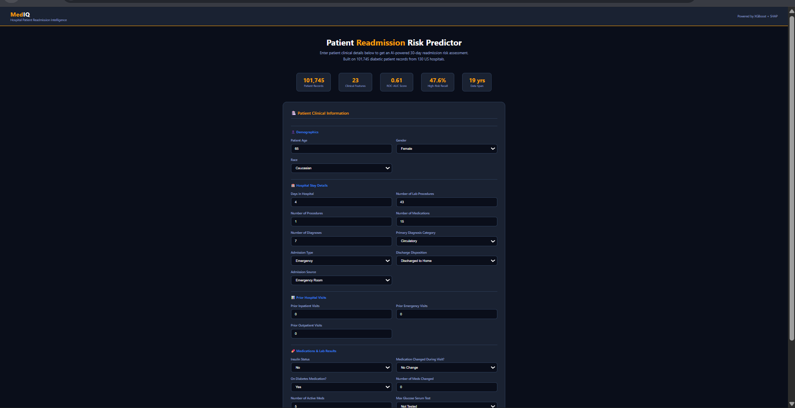
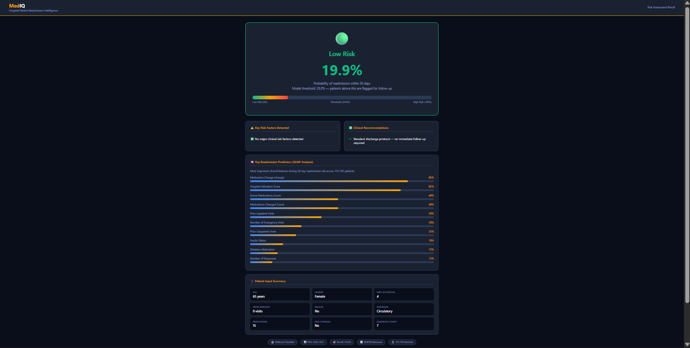
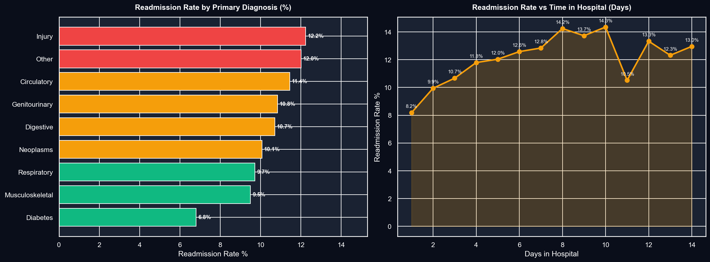
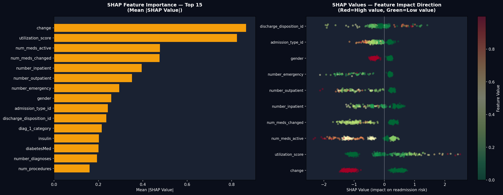

# 🏥 MedIQ — Hospital Patient Readmission Predictor

> End-to-end healthcare analytics platform — Python • SQL • XGBoost • SHAP • Flask



---

## 🎯 The Problem

Hospital readmissions within 30 days cost the US healthcare system 
$26 billion annually. Hospitals struggle to identify which patients 
are at high risk before discharge — leading to preventable readmissions 
and poor patient outcomes.

MedIQ is a clinical decision support tool that predicts 30-day 
readmission risk using machine learning — giving clinicians 
actionable insights at the point of discharge.

---

## 📊 Dataset

| Metric | Value |
|--------|-------|
| Source | UCI ML Repository — Diabetes 130-US Hospitals |
| Records | 101,745 patient encounters |
| Features | 50 clinical variables |
| Hospitals | 130 US hospitals |
| Period | 10 years of clinical data |
| Target | 30-day readmission (11.2% positive rate) |

---

## 🔬 Key Clinical Findings

| Finding | Insight |
|---------|---------|
| Strongest predictor | Prior inpatient visits — 8+ visits = 44% readmission rate |
| Highest risk diagnosis | Injury patients — 12.2% readmission rate |
| Medication signal | Insulin reduction → 13.9% readmission (highest) |
| Age paradox | 20-30 age group has 14.25% — highest of all ages |
| Weakest predictor | A1C result — only 0.4% difference across categories |
| Gender | No significant difference — 11.2% vs 11.0% |

---

## 🤖 Model Performance

| Metric | Value |
|--------|-------|
| Algorithm | XGBoost Classifier |
| Class balancing | SMOTE oversampling |
| ROC-AUC | 0.61 |
| Recall (High Risk) | 47.6% |
| Optimal threshold | 0.25 |
| Explainability | SHAP values |

---

## 🛠️ Tech Stack

| Layer | Tools |
|-------|-------|
| Data Processing | Python, Pandas, NumPy |
| Database | MySQL, SQLAlchemy |
| Machine Learning | XGBoost, Scikit-learn, SMOTE |
| Explainability | SHAP |
| Visualisation | Matplotlib, Seaborn |
| Dashboard | Power BI, DAX |
| Web App | Flask, HTML, CSS |
| Deployment | Render.com |
| Version Control | Git, GitHub |

---
---

## 🚀 How to Run Locally

```bash
# Clone the repo
git clone https://github.com/YOUR_USERNAME/mediq.git
cd mediq

# Create virtual environment
python -m venv venv
venv\Scripts\activate

# Install dependencies
pip install -r requirements.txt

# Download dataset
# https://www.kaggle.com/datasets/brandao/diabetes
# Save diabetic_data.csv → data/raw/

# Run notebooks in order (00 → 04)
# Then start Flask app
python app/app.py

# Open browser → http://127.0.0.1:5000
```

---

## 🌐 Live Demo

🔗 **[Try MedIQ Live →](https://mediq-app.onrender.com)**

---

## 📈 Screenshots

### Patient Input Form


### Risk Assessment Result


### EDA Charts


### SHAP Explainability


---

## 💡 Business Applications

- **Hospital discharge teams** — flag high-risk patients before discharge
- **Care coordinators** — prioritise follow-up calls
- **Insurance companies** — identify high-cost patients proactively
- **Health-tech startups** — integrate risk scoring into EHR systems

---

## 👤 Author

**Harshal Nanasaheb Kawane**
📧 harshalkawane3@gmail.com
🔗 [LinkedIn](https://linkedin.com/in/harshal-kawane)
📍 Pune, Maharashtra
